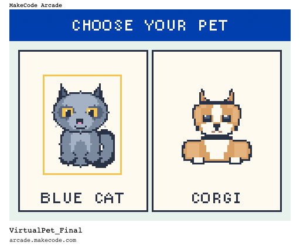
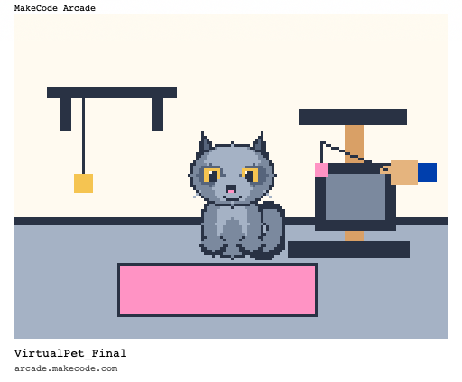
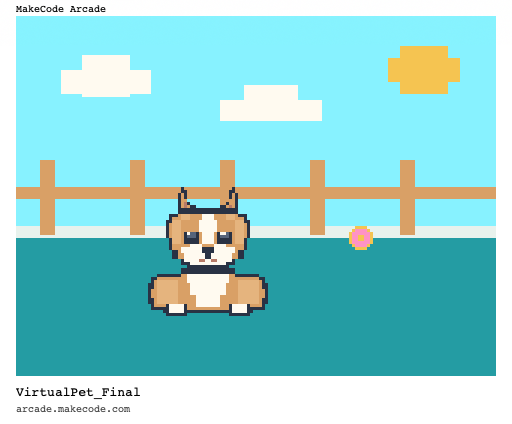
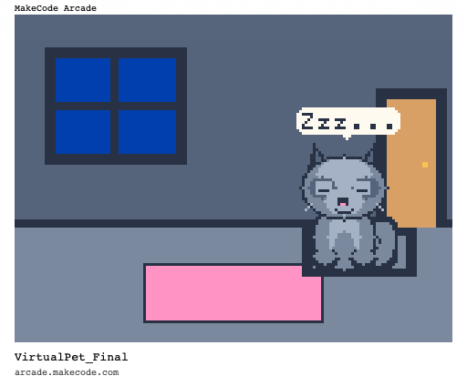

# VirtualPet

**A pixel-art virtual pet prototype created with Python in Microsoft MakeCode Arcade.**

**Author:** Yuhong Wang  
**Play online:** [Open VirtualPet in MakeCode Arcade](https://arcade.makecode.com/S33967-80338-10558-10576)

## Project overview

VirtualPet is an interactive pet-care game in which the player chooses either a blue cat or a corgi. The player looks after the selected pet through three main actions: **Feed**, **Play**, and **Rest**. Each pet has its own personality, movement, sounds, and play environment.

I wanted to create this game so that people who have never owned an animal could experience a small part of what it feels like to care for a pet, even though a digital experience cannot fully reproduce a real relationship. The idea is also personal. I previously cared for a blue cat and later felt that I had not always understood or met all of his needs before he died. That regret influenced the project's focus on careful observation, responsibility, and responsive care.

## Design concept

The central design decision is to avoid visible hunger, happiness, or energy bars. Real pets cannot communicate their feelings through numbers. Instead, the game asks the player to notice small clues in the pet's expression, movement, sound, and behaviour.

For example, a hungry pet slowly moves towards the feeding side, a playful cat wiggles, a playful corgi jumps, and a tired pet closes its eyes and displays a short `z...` message. The player may still choose a different action, but the pet gives a confused reaction. This keeps player freedom while encouraging closer attention.

After three correct care choices, the player receives a small bonding moment. The blue cat slow-blinks and purrs, while the corgi performs an excited wiggle. This provides feedback without turning care into a visible score.

## Main features

- Choice between a **Blue Cat** and a **Corgi**.
- A confirmation screen that allows the player to return and change their selection.
- Three care actions: **Feed**, **Play**, and **Rest**.
- Hidden, randomly selected pet needs that do not immediately repeat.
- Emotional communication through expressions, movement, dialogue, and sound rather than numerical status bars.
- A feeding sequence with food, a bowl, pet movement, and a positive reaction.
- Character-specific play scenes:
  - The cat enters an indoor playroom and follows a moving cat wand.
  - The corgi goes through a door into a garden, chases a ball, catches it, and brings it back.
- A night-time rest scene with closed eyes, breathing movement, and a return to the daytime room.
- Animated scene transitions that use the selected pet's face.
- Positive and confused sound cues for correct and mismatched care choices.

## Prototype screenshots

### Pet selection

### Character-specific play scenes

| Blue Cat playroom | Corgi garden |
| --- | --- |
|  |  |

### Rest state

## How to play

1. Open the game and press **A** to begin.
2. Use **Left** and **Right** to choose the Blue Cat or Corgi.
3. Press **A** to confirm the pet. Press **B** if you want to return to the selection screen.
4. In the room, observe the pet's behaviour and decide what it may need.
5. Use **Left** and **Right** to select **Feed**, **Play**, or **Rest**.
6. Press **A** to perform the selected action.
7. During a play scene, press **A** to interact and press **B** to return to the room.
8. During rest, press **B** to wake the pet and return to the daytime room.

## Controls

| Control | Function |
| --- | --- |
| Left / Right | Select a pet or move between Feed, Play, and Rest |
| A | Confirm a selection, perform a care action, or interact during play |
| B | Return from pet confirmation, leave a play scene, or wake a sleeping pet |

## Technical overview

The prototype was created in the Python editor of Microsoft MakeCode Arcade. It uses an event-driven structure in which the controller buttons call different functions depending on the current game state.

Important state variables include:

- `selected_pet` - records whether the player chose the cat or corgi.
- `selection_finished` - separates pet selection from confirmation.
- `in_room`, `in_play_scene`, and `in_rest_scene` - control which interactions are currently available.
- `action_choice` - records the selected care action.
- `pet_need` and `need_active` - manage the pet's hidden current need.
- `action_busy` - prevents overlapping animations or repeated button input.
- `care_streak` - triggers a bonding moment after three correct care choices.

The project also uses custom pixel images, sprite movement, velocity, timed pauses, random selection, controller events, simple sound sequences, and drawing functions for backgrounds and interface elements.

## Project files

| File | Purpose |
| --- | --- |
| `main.py` | Contains the complete game logic, pixel artwork, interface, animations, sound, and controller events |
| `main.ts` | MakeCode's generated TypeScript representation of the project |
| `main.blocks` | Stores the MakeCode Blocks workspace representation |
| `assets.json` | Stores project asset metadata used by MakeCode |
| `pxt.json` | Defines the MakeCode Arcade project name, files, dependency, editor type, and target version |
| `README.md` | Documents the project concept, controls, technical structure, resources, and links |
| `*.png` | Screenshots showing the pet-selection, play, and rest states |

## Running the project

### Play the published version

Open the [MakeCode Arcade share link](https://arcade.makecode.com/S33967-80338-10558-10576) and select the play button.

### Open the source in MakeCode Arcade

1. Go to [Microsoft MakeCode Arcade](https://arcade.makecode.com/).
2. Select **Import** and then **Import URL**.
3. Paste this GitHub repository URL:
   `https://github.com/bemoretenderly-creator/VirtualPet-Final`
4. Open the project in the Python editor.

## Dependencies

- [Microsoft MakeCode Arcade](https://arcade.makecode.com/)
- MakeCode Arcade `device` dependency
- Preferred editor: MakeCode Arcade Python (`pyprj`)
- Target version: MakeCode Arcade 4.1.25 / PXT 13.1.23

The project is self-contained and does not require external image, audio, or code libraries.

## Assets and credits

All character sprites, rooms, outdoor environments, food, toys, menus, and interface elements were created inside MakeCode Arcade using pixel-image code and drawing functions. No external sprite pack or downloaded game asset was used.

The following resources were used for general inspiration and to study MakeCode Arcade workflows and programming approaches. The videos helped me understand possible structures for virtual-pet interactions, but their code and visual assets were not directly copied because this project uses a different interaction system and visual design.

## References

Microsoft. (n.d.). *Microsoft MakeCode Arcade* [Computer software]. https://arcade.makecode.com/

Microsoft MakeCode. (2020, September 30). *Arcade Advanced Stream #118—As CORGUY commands!* [Video]. YouTube. https://www.youtube.com/watch?v=71zHQ0wapBU

Microsoft MakeCode. (2021, October 14). *Virtual pet—MakeCode Arcade Advanced* [Video]. YouTube. https://www.youtube.com/watch?v=t9XP7QjvgbM

## Testing and iteration

I tested the full selection, care, play, and rest paths with both pets. Feedback from friends on 17 September led me to replace the cat's outdoor play scene with an indoor playroom, which better fits the cat's behaviour. Testing with a classmate on 19 September also revealed that an incorrect care choice caused the pet to repeat its clue and limited player freedom. I changed the logic so the pet still reacts to the mismatch but allows the selected action to continue.

## Current scope

This project is a finished course prototype rather than a full commercial pet simulation. It focuses on one complete interaction loop: observing a pet, choosing an action, receiving expressive feedback, and gradually building a sense of connection. It does not currently save progress between sessions or simulate long-term health. Possible future development could include longer-term memory, more pet behaviours, additional rooms, and saved progress.
